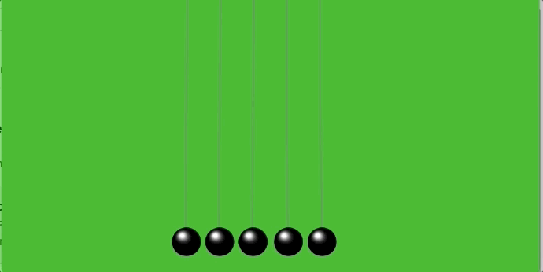

# newtons_cradle

A simulation of Newton's cradle in Flutter using flame engine and Box2D.

## Getting Started

Prepare for local run and build:
```
flutter channel master
flutter upgrade
flutter config --enable-web
```

Run in Chrome:
`flutter run -d Chrome`

Build for deployment:
`flutter build web`

Deploy to web server: copy contents of folder build/web:

The doc-folder contains the contents of such a build for web and is published as github pages.
You find it [here](https://schilken.github.io/newtons_cradle).
Do a refresh of the page to start the simulation.


